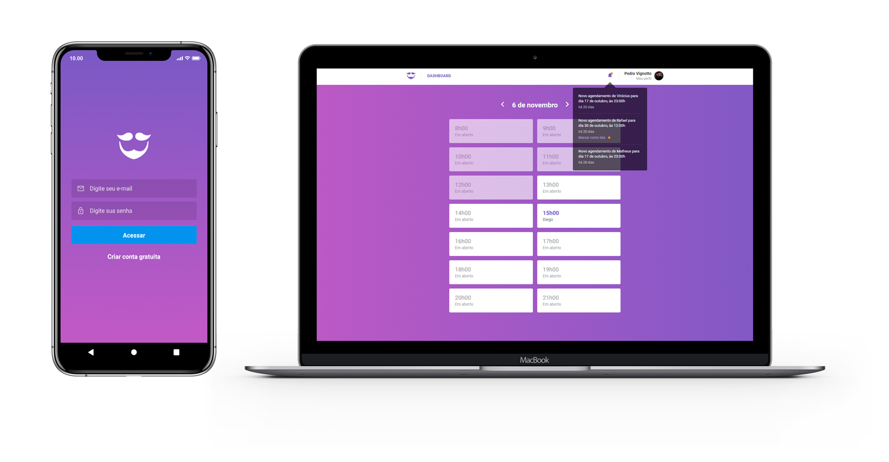

<h1 align="center">
    
</h1>

  <a href="#-instalação-e-execução">Instação e execução</a>&nbsp;&nbsp;&nbsp;|&nbsp;&nbsp;&nbsp;
  <a href="#rocket-tecnologias">Tecnologias</a>&nbsp;&nbsp;&nbsp;|&nbsp;&nbsp;&nbsp;
  <a href="#-projeto">Projeto</a>&nbsp;&nbsp;&nbsp;|&nbsp;&nbsp;&nbsp;
  <a href="#memo-licença">Licença</a>

 

  

## 🎓 Instalação e execução

1. Faça um clone desse repositório;
2. Entre na pasta rodando `cd GoBarber`;

### Backend

3. Entre na pasta rodando `cd backend`;
4. Rode `yarn` para instalar as dependências;
5. Crie um banco de dados no `postgres` com o nome de `gobarber`;
6. Renomeie o arquivo `.env.example` para `.env`;
7. Coloque as suas credenciais dentro do `.env`;
8. Rode `yarn sequelize db:migrate` para executar as migrations;
9. Rode `yarn dev` para iniciar o servidor.

### Web

3. Entre na pasta rodando `cd frontend`;
4. Rode `yarn` para instalar as dependências;
6. Rode `yarn start` para iniciar o servidor.

### Mobile

3. Entre na pasta rodando `cd mobile`;
4. Rode `yarn` para instalar as dependências;
6. Rode `yarn react-native run-ios` ou `yarn react-native run-android` dependendo do SO.

## :rocket: Tecnologias

Esse projeto foi desenvolvido com as seguintes tecnologias:

- [Node.js](https://nodejs.org/en/)
- [React](https://reactjs.org)
- [React Native](https://facebook.github.io/react-native/)
- [Redux](https://redux.js.org/)
- [Redux-Saga](https://github.com/redux-saga/redux-saga)
- [Reactotron](https://github.com/infinitered/reactotron)

## 💻 Projeto

O GoBarber é um projeto que visa conectar barbeiros fácilmente aos seus clientes, tornando o agendamento de horário e o gerenciamento da sua agenda diária de forma prática!

## :memo: Licença

Esse projeto está sob a licença MIT. Veja o arquivo [LICENSE](LICENSE.md) para mais detalhes.

---

Feito com ♥ by Pedro Vignotto :wave: [Contato](https://www.linkedin.com/in/pedro-vignotto/)
